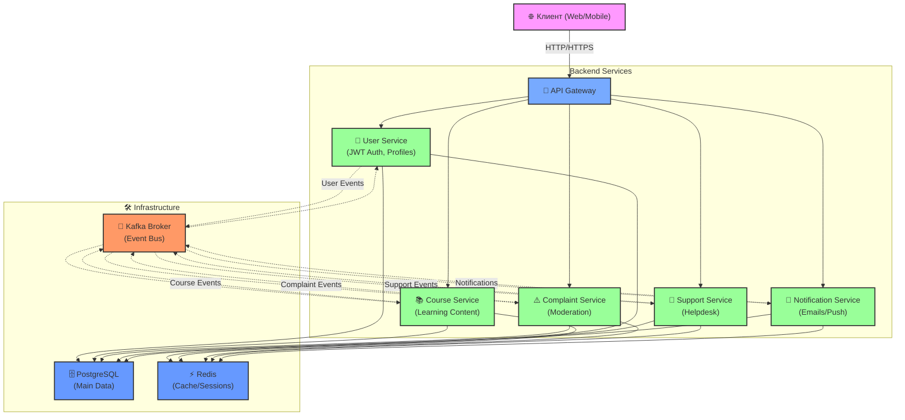

# 🧩 Архитектура микросервисного приложения Slay

Микросервисное приложение на Spring Boot с использованием Kafka, Redis, PostgreSQL и Docker. Каждый сервис отвечает за свою зону ответственности и взаимодействует с другими по HTTP и Kafka.

## 📦 Стек технологий

| Категория        | Технологии                         |
|------------------|------------------------------------|
| Язык             | Java 17                            |
| Фреймворк        | Spring Boot 3.2                    |
| Безопасность     | Spring Security, JWT               |
| Аутентификация   | Token-based (JWT)                  |
| Брокер сообщений | Apache Kafka                       |
| Базы данных      | PostgreSQL (хранение), Redis (кеш) |
| Тестирование     | JUnit                              |
| Мониторинг       | Spring Actuator                    |
| Деплой           | Docker, Docker Compose             |

## 🧠 Архитектура (Mermaid)

